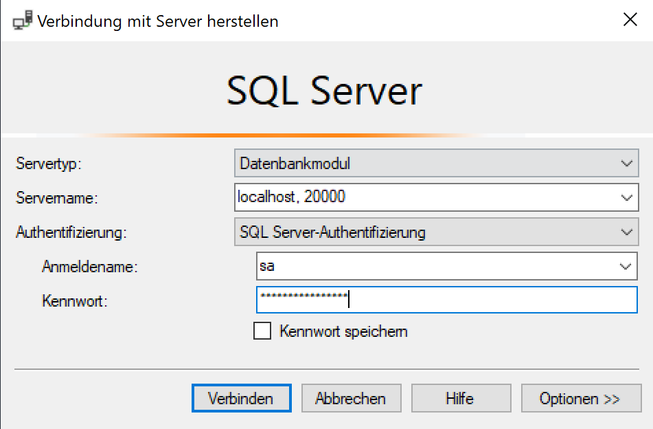

# Setup
## Installing Docker
Install Docker Desktop on your local machine. Then, run the following code block: 

    docker pull mcr.microsoft.com/mssql/server

## Start the Container
    docker run -e "ACCEPT_EULA=Y" -e "SA_PASSWORD=DatenbankenTHRO12345" -e "MSSQL_PID=Express" -p 20000:1433 -d mcr.microsoft.com/mssql/server

Alternattively for M1 Mac you can use:

    docker run -e "ACCEPT_EULA=1" -e "MSSQL_SA_PASSWORD=MyPass@word" -e "MSSQL_PID=Developer" -e "MSSQL_USER=SA" -p 20000:1433 -d --name=sql mcr.microsoft.com/azure-sql-edge

## Connect to the Database
